<!-- Animated Header with Wave -->


<!-- Custom Animated Typing SVG -->
<p align="center">
  
</p>

<!-- Animated Profile Badges -->
<p align="center">
  
  <a href="https://ewan-judio-portfolio.vercel.app/">
    
  </a>
  <a href="https://github.com/ewan2005?tab=followers">
    
  </a>
</p>

<!-- Animated Separator Line -->


<!-- About Me Section with Animation -->
<h2>
  
  About Me
</h2>


```javascript
const ewan = {
    location: "Madagascar 🇲🇬",
    education: "ITU - Computer Science",
    currentFocus: "Full-Stack Web Development",
    hobbies: ["Coding 💻", "Learning 📚", "Creating 🎨"],
    funFact: "I turn coffee ☕ into code!"
};
```

<br>

- 🔭 I'm currently working on **exciting projects**
- 🌱 I'm constantly learning **new technologies**
- 💬 Feel free to ask me about **web development**
- 📫 Reach me through **my portfolio**
- ⚡ Fun fact: **The first computer bug was an actual insect!** 🐛

<br clear="both">

<!-- Animated Separator Line -->


<!-- Tech Stack Section -->
<h2>
  
  Tech Stack
</h2>

<p align="center">
  <a href="https://skillicons.dev">
    
  </a>
</p>

<!-- Alternative Tech Badges Style -->
<p align="center">
  
  
  
  
  
  
  
  
  
  
</p>

<!-- Activity Graph -->
<p align="center">
  
</p>

<!-- Snake Animation Section -->
<h2>
  
  Contribution Snake
</h2>

<!-- Custom Contribution Stats SVG -->
<p align="center">
  
</p>

<p align="center">
  <picture>
    <source media="(prefers-color-scheme: dark)" srcset="https://raw.githubusercontent.com/ewan2005/ewan2005/output/github-snake-dark.svg" />
    <source media="(prefers-color-scheme: light)" srcset="https://raw.githubusercontent.com/ewan2005/ewan2005/output/github-snake.svg" />
    
  </picture>
</p>

<!-- Animated Separator Line -->


<!-- Contact Section -->
<h2>
  
  Let's Connect!
</h2>

<p align="center">
  <a href="https://ewan-judio-portfolio.vercel.app/" target="_blank">
    
  </a>
  <a href="https://github.com/ewan2005" target="_blank">
    
  </a>
  <a href="mailto:ewanjudiotsarazaka@gmail.com" target="_blank">
    
  </a>
</p>

<!-- Animated Quote -->
<p align="center">
  
</p>

<!-- Spotify (optional - customize) -->
<!-- 
<p align="center">
  
</p>
-->

<!-- Animated Footer with Wave -->


<!-- Animated Closing Message -->
<p align="center">
  
</p>

<p align="center">
  
  
</p>